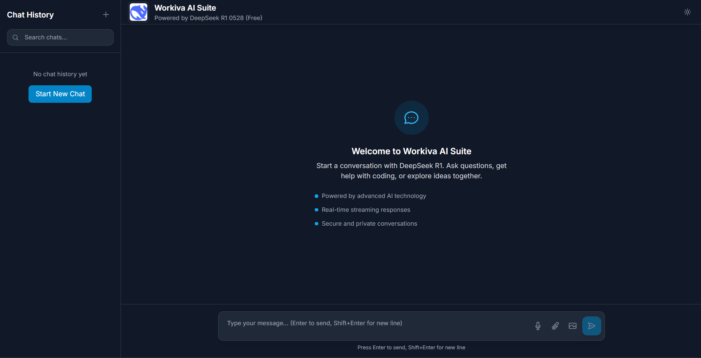

# Workiva AI Suite

A production-grade AI chat web application powered by DeepSeek R1 0528 (free), featuring real-time streaming responses, modern UI/UX, and robust architecture. Built with React 18, TypeScript, and Tailwind CSS, this application provides an intuitive chat interface with advanced AI capabilities.



## Features

- **DeepSeek R1 0528 Integration** - Powered by advanced AI technology via OpenRouter API (free tier)
- **Real-time Streaming** - Watch responses generate in real-time with smooth streaming
- **Modern UI/UX** - Clean, responsive design with dark/light themes and system preference detection
- **Persistent Chat History** - Messages automatically saved to localStorage across sessions
- **Keyboard Shortcuts** - Enter to send, Shift+Enter for new lines, full keyboard navigation
- **Production Ready** - TypeScript, comprehensive testing, linting, and CI/CD pipeline
- **Accessible** - Full ARIA support, semantic HTML, and keyboard navigation
- **Responsive** - Works seamlessly across desktop, tablet, and mobile devices
- **Error Handling** - Robust error boundaries and user-friendly error messages
- **Auto-scrolling** - Chat container automatically scrolls to latest messages
- **Loading States** - Visual feedback during API calls and streaming
- **Clear History** - Confirmation modal for clearing chat history

## Quick Start

### Prerequisites

- Node.js 18+ and npm
- OpenRouter API key for DeepSeek R1 access

### Installation

1. Clone the repository:

```bash
git clone <repository-url>
cd workiva-ai-suite
```

2. Install dependencies:

```bash
npm install
```

3. Set up environment variables:

```bash
cp env.example .env.local
```

Edit `.env.local` and add your OpenRouter API key:

```env
VITE_OPENROUTER_API_KEY=your_openrouter_api_key_here
```

4. Start the development server:

```bash
npm run dev
```

## Development

### Available Scripts

```bash
# Development
npm run dev          # Start development server with hot reload
npm run preview      # Preview production build locally

# Building
npm run build        # Build for production
npm run type-check   # Run TypeScript type checking

# Testing
npm run test         # Run tests with coverage
npm run test:ui      # Run tests with UI interface

# Code Quality
npm run lint         # Run ESLint
npm run lint:fix     # Fix ESLint errors automatically
npm run format       # Format code with Prettier
```

### Project Structure

```
src/
├── api/              # API integration
│   └── deepseek.ts   # DeepSeek R1 API wrapper
├── components/       # React components
│   ├── __tests__/    # Component tests
│   ├── ChatContainer.tsx
│   ├── ChatInput.tsx
│   ├── ClearHistoryModal.tsx
│   ├── ErrorBoundary.tsx
│   ├── Header.tsx
│   └── MessageBubble.tsx
├── hooks/            # Custom React hooks
│   └── useChat.ts    # Chat functionality hook
├── store/            # State management
│   ├── __tests__/    # Store tests
│   └── chatStore.ts  # Zustand store
├── test/             # Test configuration
│   └── setup.ts      # Test setup
├── types/            # TypeScript types
│   └── index.ts      # Type definitions
├── App.tsx           # Main app component
├── main.tsx          # App entry point
└── index.css         # Global styles
```

## Architecture

### Technology Stack

- **Frontend**: React 18 with TypeScript for type safety and modern features
- **Build Tool**: Vite for fast development and optimized production builds
- **Styling**: Tailwind CSS with custom design tokens and responsive utilities
- **State Management**: Zustand for lightweight, persistent state management
- **Data Fetching**: React Query for API data handling and caching
- **HTTP Client**: Axios for non-streaming requests, fetch API for streaming
- **Testing**: Vitest and Testing Library for comprehensive testing
- **Code Quality**: ESLint (Airbnb + TypeScript) and Prettier
- **Git Hooks**: Husky and lint-staged for pre-commit quality checks

### Key Architectural Decisions

1. **Streaming Responses**: Uses Server-Sent Events (SSE) for real-time AI response streaming
2. **Local Storage**: Chat history persisted using Zustand's persistence middleware
3. **Component Architecture**: Functional components with hooks, organized by feature
4. **Error Handling**: React Error Boundaries and centralized error state management
5. **Accessibility**: Comprehensive ARIA support and keyboard navigation
6. **Testing Strategy**: Unit tests for components and integration tests for hooks/stores

### State Management

The application uses Zustand for state management with the following structure:

- **Chat Messages**: Array of user and AI messages with timestamps
- **Loading State**: Boolean indicating if a request is in progress
- **Error State**: Error message and details for failed requests
- **Streaming State**: Current streaming message content

State is automatically persisted to localStorage and restored on page reload.

## Testing

The project includes comprehensive testing with Vitest and Testing Library:

- **Unit Tests**: Component and utility function tests with high coverage
- **Integration Tests**: Store and hook tests for state management
- **Accessibility Tests**: ARIA labels and keyboard navigation verification
- **Coverage Reports**: Aim for 90%+ coverage on critical paths

Run tests:

```bash
npm run test              # Watch mode with coverage
npm run test:ui           # With UI interface
```

### Testing Strategy

- Tests focus on user behavior and component interactions
- Mock external dependencies (API calls, browser APIs)
- Test error states and edge cases
- Ensure accessibility compliance
- Verify state management correctness

## Deployment

### Build for Production

```bash
npm run build
```

The built files will be in the `dist/` directory, ready for deployment to any static hosting service.

### Deployment Options

#### Vercel (Recommended)

1. Connect your repository to Vercel
2. Set environment variables in Vercel dashboard:
   - `VITE_OPENROUTER_API_KEY`
3. Deploy - Vercel will automatically build and deploy

#### Netlify

1. Connect your repository to Netlify
2. Set build settings:
   - Build command: `npm run build`
   - Publish directory: `dist`
3. Set environment variables in Netlify dashboard
4. Deploy

#### GitHub Pages

1. Install gh-pages: `npm install --save-dev gh-pages`
2. Add scripts to package.json:
   ```json
   {
     "scripts": {
       "predeploy": "npm run build",
       "deploy": "gh-pages -d dist"
     }
   }
   ```
3. Configure repository settings for Pages
4. Run `npm run deploy`

#### Manual Deployment

1. Build the project: `npm run build`
2. Upload the `dist` folder to your web server
3. Configure your server to serve `index.html` for all routes

### Environment Variables

For platforms that don't support environment variables, you can use build-time variables:

```bash
VITE_OPENROUTER_API_KEY=your_key_here npm run build
```

Or create a runtime configuration file for development purposes.

## Security Considerations

- API keys are stored in environment variables and never committed to version control
- All user inputs are sanitized and validated
- HTTPS is enforced in production environments
- Regular dependency updates and security audits
- No sensitive data is logged or stored in localStorage beyond chat history

## Customization

### Styling

The application uses Tailwind CSS with a custom design system:

- **Colors**: Primary palette with light/dark variants
- **Typography**: Inter font family with consistent spacing
- **Animations**: Smooth micro-interactions and transitions
- **Components**: Reusable UI components with consistent styling

Modify `tailwind.config.js` to customize:

- Colors (primary, gray palettes)
- Animations (fade-in, slide-up, etc.)
- Typography (Inter font family)

### Themes

The app supports light and dark themes with `prefers-color-scheme`. Users can toggle themes manually via the header button.

### Components

All components are modular and reusable. Key customization points:

- `MessageBubble.tsx` - Chat message styling
- `ChatInput.tsx` - Input field behavior
- `Header.tsx` - App branding and navigation

## Contributing

1. Fork the repository
2. Create a feature branch (`git checkout -b feature/amazing-feature`)
3. Make your changes following the coding standards
4. Add tests for new functionality
5. Run the test suite (`npm run test`)
6. Commit your changes (`git commit -m 'feat: add amazing feature'`)
7. Push to the branch (`git push origin feature/amazing-feature`)
8. Open a Pull Request

### Development Guidelines

- Follow the existing code style and conventions
- Write tests for new features
- Ensure all tests pass before submitting
- Update documentation as needed
- Use conventional commit messages
- Maintain 90%+ test coverage
- Follow TypeScript strict mode
- Adhere to ESLint and Prettier rules

### Coding Standards

- **TypeScript** - Strict mode enabled with comprehensive type checking
- **ESLint** - Airbnb + TypeScript rules for code quality
- **Prettier** - Consistent code formatting across the project
- **Conventional Commits** - Standardized commit message format
- **Testing** - 90%+ coverage target with meaningful tests

## Troubleshooting

### Common Issues

1. **Build Failures**
   - Check Node.js version compatibility (18+)
   - Ensure all dependencies are installed
   - Verify TypeScript compilation

2. **API Key Issues**
   - Verify environment variable name: `VITE_OPENROUTER_API_KEY`
   - Check API key validity
   - Ensure key has proper permissions

3. **CORS Errors**
   - OpenRouter API supports CORS
   - If using a proxy, configure CORS headers

4. **404 Errors on Refresh**
   - Configure SPA routing
   - Ensure `index.html` is served for all routes

### Performance Optimization

- Enable compression (gzip/brotli) on your server
- Use a CDN for better global performance
- Configure caching headers appropriately
- Monitor bundle size with `vite-bundle-analyzer`

## Monitoring and Maintenance

- Set up error tracking (Sentry, LogRocket)
- Monitor performance with Web Vitals
- Keep dependencies updated
- Monitor for security vulnerabilities
- Update API keys periodically

## License

This project is licensed under the MIT License - see the [LICENSE](LICENSE) file for details.

## Acknowledgments

- [DeepSeek](https://www.deepseek.com/) - Advanced AI technology
- [OpenRouter](https://openrouter.ai/) - API gateway
- [React](https://reactjs.org/) - UI framework
- [Tailwind CSS](https://tailwindcss.com/) - Styling framework
- [Vite](https://vitejs.dev/) - Build tool

## Support

For support and questions:

- Create an issue in the repository
- Check the documentation
- Review the test files for usage examples

---

Built with dedication by the Workiva team
